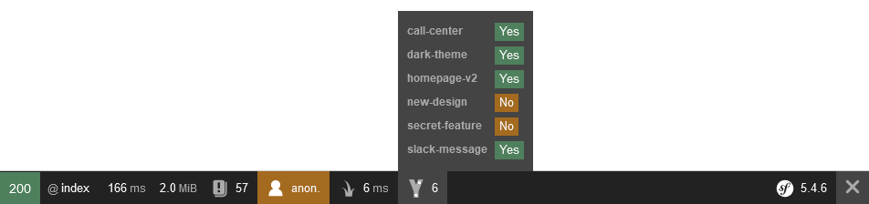
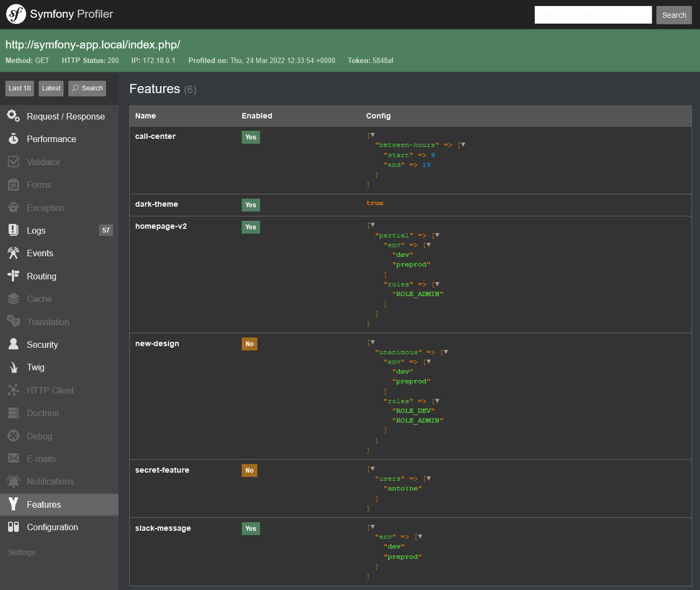

# Progressive Bundle

Symfony integration for the feature-flag library [Progressive](https://github.com/antfroger/progressive)

[](https://github.com/antfroger/progressive-bundle)
[](https://packagist.org/packages/antfroger/progressive-bundle "Latest stable version")

## Installation

Install this bundle using Composer:

```console
composer require antfroger/progressive-bundle
```

## Configuration

### 1. Enable the Bundle

First, enable the bundle by adding it to the list of registered bundles
in the `config/bundles.php` file of your project:

```php
// config/bundles.php

return [
    // ...
    Af\ProgressiveBundle\AfProgressiveBundle::class => ['all' => true],
];
```

### 2. Configure the Bundle

Create the configuration file `config/packages/af_progressive.yaml`.

The only required key is `config`.
The key needs the path of the yaml file where you will configure the features of your application.  
The minimal configuration looks like this:

```yaml
# config/packages/af_progressive.yaml
af_progressive:
  config: '%kernel.project_dir%/config/features.yaml'
```

But, you can also define under the `context` key, variables that will be stored in the [Contex object](https://github.com/antfroger/progressive#context-object).

```yaml
# config/packages/af_progressive.yaml
af_progressive:
  config: '%kernel.project_dir%/config/features.yaml'
  context:
    env: '%kernel.environment%'
```

Then, you need to create the file that will contain your features.  
It must contain at least the `features` key:

```yaml
# config/features.yaml
features: []
```

But quickly, you can start adding many more features:  
*(every time you change this file, you may need to clear the cache og your application: `php bin/console cache:clear`)*

```yaml
# config/features.yaml
features:
  dark-theme: true
  call-center:
    between-hours:
        start: 9
        end: 19
  homepage-v2:
    partial:
      env: ['dev', 'preprod']
      roles: ['ROLE_ADMIN']
  slack-message:
    env: ['dev', 'preprod']
  secret-feature:
    users: ['antoine']
  new-design:
    unanimous:
      env: ['dev', 'preprod']
      roles: ['ROLE_DEV', 'ROLE_ADMIN']
```

Look at [Progressive documentation](https://github.com/antfroger/progressive#usage) to know more about the features' configuration.

## Usage

You can use Progressive in a controller using [Symfony's autowiring](https://symfony.com/doc/current/service_container/autowiring.html):

```php
  public function info(Progressive $progressive): Response
  {
      if ($progressive->isEnabled('call-center')) {
          // Do what you want when the feature `call-center` is enabled
      }
  }
```

Or in a template:

```twig

    {# Do what you want when the feature `call-center` is enabled #}

```

## Rules

### Built-in rules

Progressive comes with several built-in rules:

* `enabled: true|false`  
[`enabled`](https://github.com/antfroger/progressive#enabled-truefalse) enables (or disables) the feature for everyone, everywhere, all the time.

### Symfony specific rules

This bundle provides Symfony specific rules:

* [`env: []`](#environments-)
* [`roles: []`](#roles-)
* [`users: []`](#users-)

#### `env: []`

`env` enables (or disables) the feature depending on the app environment.  
The value is meant to be an array of environment' names.

```yaml
features:
  send-slack-message:
    env: ['dev', 'preprod']
```

#### `roles: []`

`roles` only enables (or disables) the feature for specific roles.  
The value is meant to be an array of roles' names.

*This example configuration enables the feature `new-amazing-homepage` only for admins and dev.*

```yaml
features:
  new-amazing-homepage:
    roles: ['ROLE_ADMIN', 'ROLE_DEV']
```

#### `users: []`

`users` is more fine-grained than `roles` because, it allows you to enable a feature at a user level.  
The value is meant to be an array of usernames.

*This example configuration enables the feature `secret-feature` only for the users antoine and ted.*

```yaml
features:
  secret-feature:
    users: ['antoine', 'ted']
```

### Create your own rules

I'm sure that soon you will want to create your own rules to progressively enable features dependning on your application logic.  
That's where custom rules come into play! (More information about **custom rules** on the [Progressive doc](https://github.com/antfroger/progressive#custom))

To create your own rules and use them in your `feature. yaml` file, you only need to create a class extending `Progressive\Rule\RuleInterface`.  
That's it!  
Symfony autowiring takes care of the rest.

Let's say you want to display a chat in your contact page, but only in working hours (for instance between 9am and 7pm).

1. First, create the rule:

```php
// src/Progressive/BetweenHours.php
namespace App\Progressive;

use Progressive\ParameterBagInterface;
use Progressive\Rule\RuleInterface;

class BetweenHours implements RuleInterface
{
    /**
     * {@inheritdoc}
     */
    public function getName(): string
    {
        return 'between-hours';
    }

    /**
     * {@inheritdoc}
     */
    public function decide(ParameterBagInterface $bag, array $hours = []): bool
    {
        if (!isset($hours['start']) || !is_int($hours['start']) || !isset($hours['end']) || !is_int($hours['end'])) {
            return false;
        }

        $now = new \DateTime();
        $hour = $now->format('H');
        return $hours['start'] <= $hour && $hour < $hours['end'];
    }
}
```

2. Now, you can use this new rule, in the `feature. yaml` file

```yaml
features:
  customer-service-chat:
    between-hours: # same as `BetweenHours::getName()`
      start: 9
      end: 19

```

3. You now have a feature using this new rule.  
Let's use it in a controller or in a template:

```php
public function customerService(Progressive $progressive): Response
  {
      if ($progressive->isEnabled('customer-service-chat')) {
        // ...
      }
  }
```

```twig

    {# Display the chat #}

```

### Strategies

Thanks to strategies, you can combine the power of rules.  
Let's say you want to enable your new feature `one-click-payment`:

* for everyone in dev and preprod...
* but only for admins in prod...
* and two beta-testers (antoine and laurent).

This configuration will do the job:

```yaml
features:
  one-click-payment:
    partial:
      env: ['dev', 'preprod']
      roles: ['ROLE_ADMIN']
      users: ['antoine', 'laurent']
```

Progressive comes with two built-in rules:  
(but as they simply are nested rules, you can create your own [strategies](https://github.com/antfroger/progressive/blob/main/README.md#strategies)!)

* `unanimous: []`  
[`unanimous`](https://github.com/antfroger/progressive#unanimous-) is a strategy (a combinaison of several rules). It enables the feature if all the conditions are met / if all the rules are true.
* `partial: []`  
[`patial`](https://github.com/antfroger/progressive#partial-) is also a strategy. It enables the feature if only one of the conditions is met / if at least one of the rules is true.

## Commands

### `progressive:features`

The command `progressive:features` lists all the features configured in Progressive:

```bash
  $ php bin/console progressive:features
  Available features:
    dark-theme
    homepage-v2
    customer-service-chat
```

If you specify the name of the feature, its configuration will be displayed:

```bash
  $ php bin/console progressive:features dark-theme
  Name:
    dark-theme

  Config:
    unanimous:
      env: dev, preprod
      roles: ROLE_DEV
```

### `progressive:rules`

The command `progressive:rules` lists the rules provided by Progressive:

```bash
  $ php bin/console progressive:rules
  Available rules:
    enabled
    env
    partial
    roles
    unanimous
    users
```

## Web toolbar & profiler

In order to have an quick and easy access to the available features of your application - and see which ones are enabled for you -
Symfony's web toolbar includes a tab with your defined features.



Symfony's profiler also includes a tab listing all the features of the application and their respective configuration.


